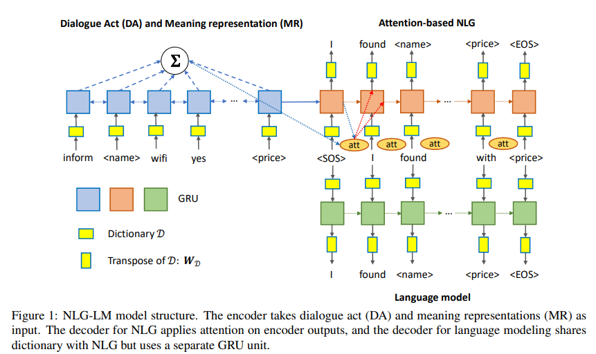
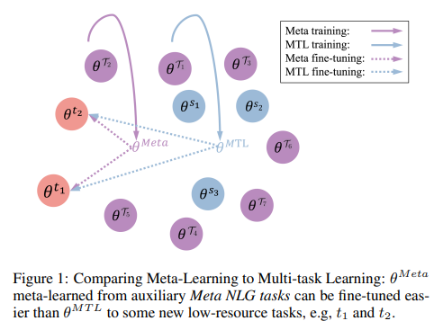
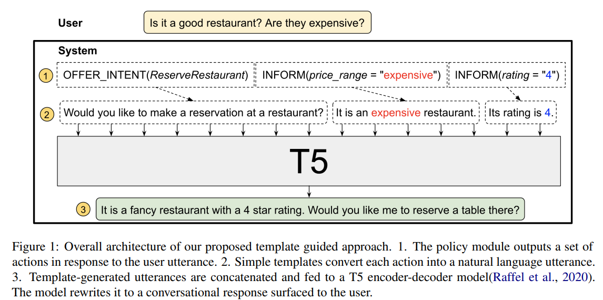
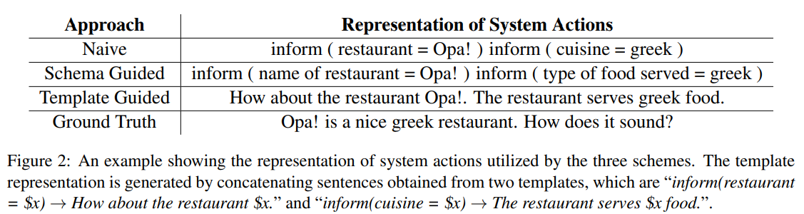

# 3-21 Reading Notes

### Multi-task Learning for Natural Language Generation in Task-Oriented Dialogue

EMNLP 2019 MS Research short paper

#### Motivation

很多研究可以生成语义上正确的回复，但是不能生成流畅、human-liked language。提出一个NLG-LM架构，可以生成高质量更自然的回复。其实是一个多任务框架，同时训练language model 和任务型对话生成，而且language model、

#### Problem Description

meaning representation -- MR -- slot pair

还有 dialogue act DA -- such as  inform request  confirm

#### Conclusion

其实就是一个多任务框架，两个都是用GRU编码，Decoder双GPU设计。

针对NLG的decoder-GRU还会对encoder编码的信息做attention

而LM的decoder-GRU只面向标准回复语句学习

但是两个GRU会共享一套dictionary

### Meta-Learning for Low-resource Natural Language Generation in Task-oriented Dialogue Systems

#### Motivation

引入Meta-Learning到low-resource的NLG in TODs

#### Method

base on MAML 这种元学习方法主要是：通过多种训练任务T及其对应的训练数据D，找到函数F。F可以输出一个函数f，f可以用于新的任务

#### Settings

##### Domain Adaptation

这个设置将一个domain作为target domain，使用剩余的domain全集作为训练集，然后在target domain上使用low-resource setting fine-tune size(1000, 500, 200)

除此之外，还有两种情况：

+ near-domain adaption-只包含domain-specific slots
+ far-domain adaption-同时有domain-specific slots和DA
+ 这里DA不同说明句式不同了，需要更强的adaption

##### DA Type Adaption

挑了两个DA type “Recommend”“ Book”分别作为target，low-resource size是500

#### Conclusion

meta-learning比直接在target domain上使用全部数据进行有监督的训练还要好。但是其实实验设置上还是有些问题，比如只有domain的shift和DA的shift，其实还希望更多一些别的设置。可能short paper 限于篇幅，不能很好地展开各类情况。

### Template Guided Text Generation for Task-Oriented Dialogue

EMNLP-20 Google long paper

#### Motivation

前人的问题有

+ 传统方法的templates需要人工构造，而且面对新领域需要重新工作，多且复杂
+ 而最近的data-driven方法需要大量的数据，不能很好的适应low-resource或是few-shot的情况
+ pre-trained model是在大规模自然语言语料上训练的，不能handle da slot类的输入

所以

+ 提出了两个method来解决zero-shot few-shot问题
  + Schema-Guided，使用自然语言来描述slot value
  + Template Guided Text Generation(T2G2)，使用一个简单的template-based来表示system actions，从而将NLG任务转为一个语句重写的任务
+ 提供了SGD上的第一个NLG结果

#### Model

##### Naive Representation

这种类型的输入问题在于

1. 没有slot的语义信息
2. 输入格式与pre-trained model在训练阶段见到的相差太大

##### Schema Guided Representation

为Naive表示扩展了slot的自然语言描述

##### Template Guided Represention

为每种slot建立了一个简单的template，直接使用这个template去描述这个slot。

注意这里不是为了去生成流畅和语法正确的句子，而是为actions提供一个简单的表示，为model来rewritten来提供基础