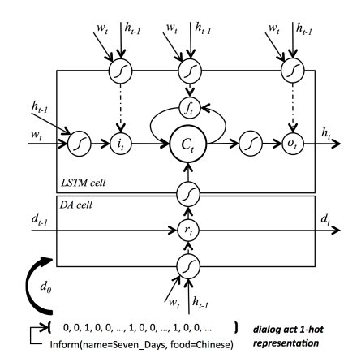
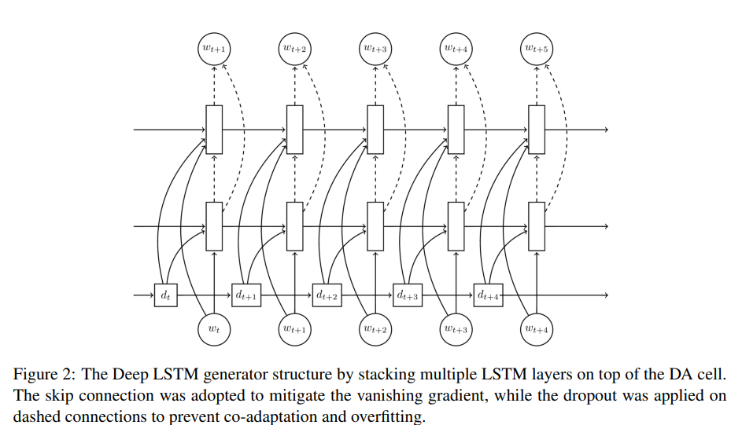
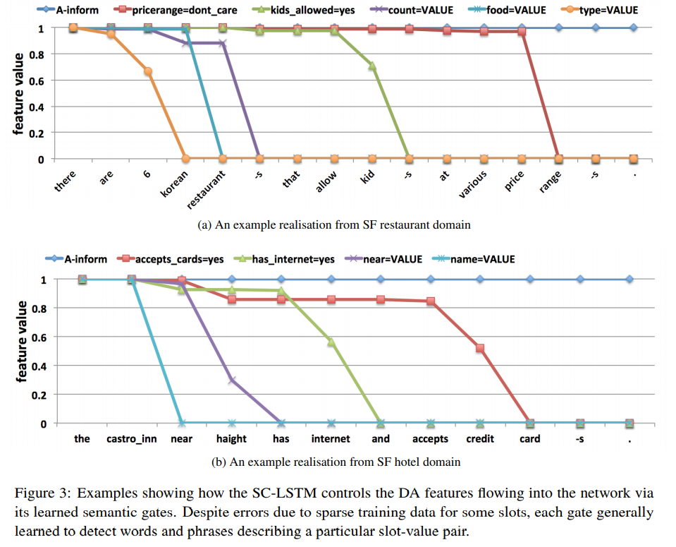
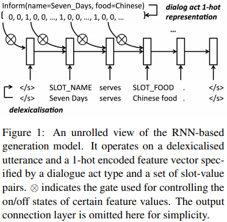

# 3-22 Reading Notes

今天主要是阅读Tsung-Hsien Wen的两篇15年的工作，被引量很高，有一篇可以说是开创了在这其中使用LSTM的先河，同时也获得了EMNLP-15的best paper

### Semantically Conditioned LSTM-based Natural Language Generation for Spoken Dialogue Systems

EMNLP 2015 best paper

#### Motivation

前人的问题-template 前人初步探索过用神经网络

这里考虑引入LSTM来生成回复。

#### Model

图中的上半部分是original LSTM Cell。这里引入了下半部分的DA cell，用于控制slot语义信息的传递。

DA cell设计上也很简单。初始输入是one-hot向量，通过一个门控进行更新。同时这个输出的结果会对LSTM cell的当前细胞状态产生影响。

初始词向量没有encoder，而是直接使用了GloVe词向量(2014) dropout(2014)

#### Experiment

从这个可视化的图中可以发现，gate真的在不断的控制其中数值的one-hot数值的下降。确实是做到了效果。

#### Conclusion

开创了在任务型对话NLG上使用LSTM的先河，虽然现在看来方法较为简单，但是推回到6年前，还是非常潮流的，用了很多当时刚刚提出的东西，比如dropout GloVe等。

但是这个one-hot编码同时也有巨大的问题，比如如果一个slot要使用多次，那么后续就难以再次生成这个值；同时one-hot编码的语义信息较少，虽然在其中说是semantic LSTM，但是其实也就是简单的进行了一下设计，这个点也成为了后人抨击和改进的地方。

而且这里生成句子最后用的是ranking的方式，而不是beam search

### Stochastic Language Generation in Dialogue using Recurrent Neural Networks with Convolutional Sentence Reranking

SIGDIAL 2015 best paper

#### Motivation

动机几乎和上一篇一样，但是这一篇在方法上是上一篇的简化版。因为是SIGDIAL

#### Model

结构上比较简单，其实就是一个RNN结构加上一个控制semantic的gate。与上一篇不一样的是，这里输入的word vector是one-hot。dialog act也是其中信息的one-hot拼接。

但是这里的门机制和上一篇不一样的地方在于，这里只是单纯的使用了一个与小于1的变化数的乘积来控制输入的semantic信息，相较于上一篇使用了可训练的矩阵和激活函数来控制，是一个弱化版。

而且这样的方式需要启发式的门禁控制来确保系统响应中包含所有的slot-value对

在结果的选择上，设计了两种模式，一次性假设会输出5个预选结果。它会使用CNN或者是backward RNN来对其进行打分。然后选择输出更好的结果。不足的是，在实验设置上，并没有对baseline输出的结果进行CNN筛选，缺少了一些消融实验的设置。上一篇中也说到了，使用CNN进行打分其实对于处理异常的slot-value比较随意。