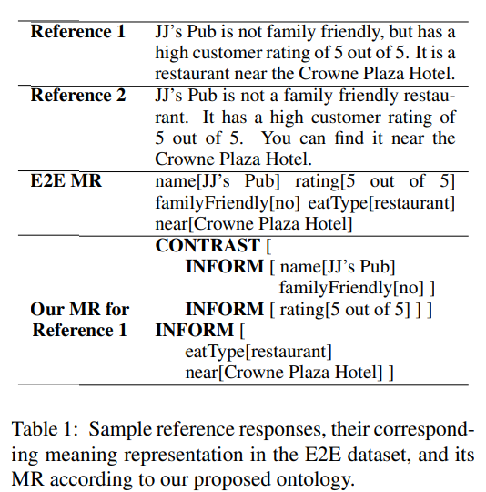
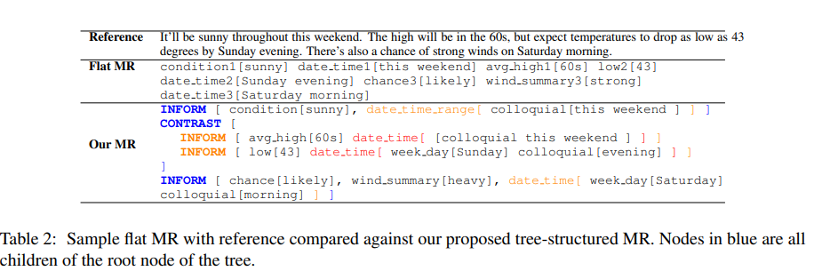
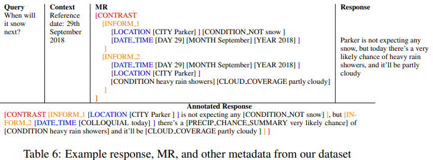
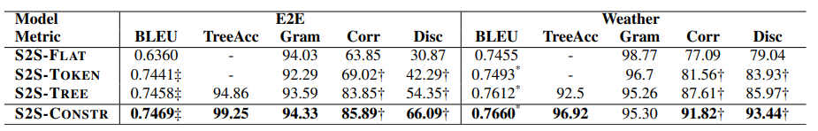
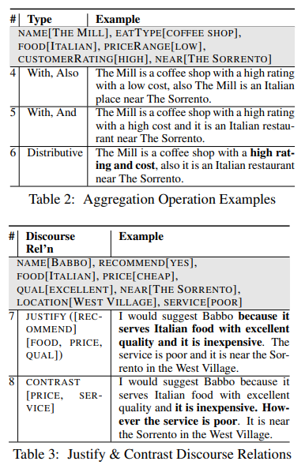
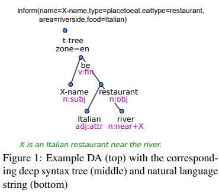
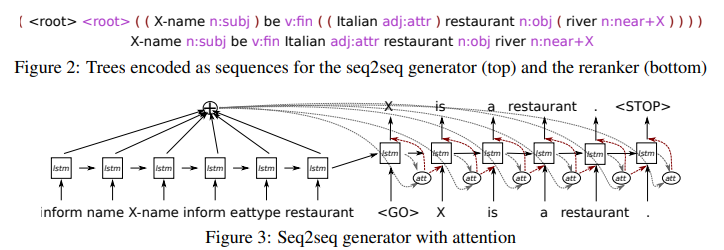
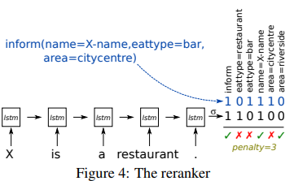
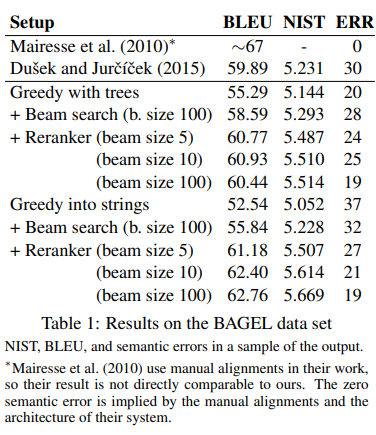

# 3-30 Reading Notes

### Constrained Decoding for Neural NLG from Compositional Representations in Task-Oriented Dialogue

ACL 2019

#### Motivation

之前对待MR都是线性输入，缺失了其中的结构信息。比如有些slot之间需要对比，有些存在排序。这就需要引入结构化的信息去约束

想要通过输入就建立一种树形结构来完成，同时输出也是一种树形结构。同时要针对已有的数据集进行改动，增加slot间的关系描述。还新构造一个数据集来提高贡献。

#### MRs to Tree MRs

Tree MRs包含三个部分：

+ Argument 可以是回复中应该出现的任意的entity或者slot，有些可能比较复杂，包含了sub-argument（比如date_time包含了week-day+month）
+ Dialog act 就是这句话的回复句式类型，比如：Inform，Recommend等。一个dialog act可以包含一个或者多个argument
+ Discourse relation 约束关系：决定了dialog act之间的关系

一个线性flat的MR难以表现

+ argument和dialog act之间的关系
+ 哪些属性应该成组，哪些属性应该对比
+ 某些argument的语义等价性
+ 难以重复使用argument

#### Model

Seq2Seq with linearized trees

encoder decoder都是LSTM+attn，decoder使用beam search

输入是带有标记的树，输出也是带有树标记的输出。好处是可以直接观察到输入和输出是否对齐

##### Constraint Decoder

在Decoding阶段，如果生成了一个未封闭的token，比如[name，那么会检查这个token是否是当前parent的子节点，如果不是就是非法的；或者是否这个token已经在当前的parent节点生成过了，也是非法的，避免repeat和hallucination。

如果生成了一个封闭的token，比如]或是EOS，那么就检查是否当前parent的所有的children都被生成过了，或者是对current parent进行一个省略。

在beam search中，违反树约束的候选者分数将被屏蔽，以使得它们不会继续前进。通过在beam search中尽早的删除违反约束的候选，可以使得decoder探索更多的假设情况

但是依旧会出现hallucinate现象

#### Experiment

s2s-flat 直接输入flat mr

s2s-token

s2s-tree 输入树结构的mr

s2s-constr 树结构+constraint decoder

#### Relative Works

这篇paper是基于SIGGEN2018一篇文章 [Can Neural Generators for Dialogue Learn Sentence Planning and Discourse Structuring?](https://www.aclweb.org/anthology/W18-6535.pdf) 的基础上提出的, 这篇文章主要是使用了一些先导语来提示dialog act还有slot之间的一些关系, 但是没有引入树结构去进行分析, 依旧还是一个seq2seq的flat输入

#### Conclusion

从树结构输入到树结构输出, 为模型生成的句子加上了更强制的semantic监督. 能够生成更加合理的句子. 但是对于数据集的构造上提出了更高的要求. 还有就是如何让上游模块对此类的输入进行适配也是一个问题.

### Sequence-to-Sequence Generation for Spoken Dialogue via Deep Syntax Trees and Strings

ACL 2016 short paper

#### Motivation

前人工作将NLG工作分成sentence planning和surface realization 两步，sentence planning是生成一个句子结构树，surface realization则是确定单词形式，将结构化为一个自然语言字符串。

这里提出一种新的seq2seq的模型，既可以从input到语法树，也可以直接从input到自然语言。可以直接比较一下，到底是分两步做比较好，还是一步到位比较好。

#### Model

这里的input是正常MRs。生成深层语法树，可以使用来自TectoMT的surface realization将其转为自然语言句子。

两种模式都有其优点：

+ 两步模式通过抽取出复杂的表面语法和形态来简化生成器，而这些语法和形态可以人工去做，确保了语法正确性
+ 联合模式就减少了人工，避免pipeline错误

#### Seq2Seq

encoder使用LSTM编码

decoder加上attention的句子信息，这里的句子信息直接就是句子级别的attention分数乘上每个词的加权和

reranker采用汉明距离打分。首先会将输入的DA转换为一个multi-one-hot向量。然后将之前的输出结果再过一遍encoder+线性层+sigmoid得到一个这个生成结果的multi-one-hot向量，来计算汉明距离得到分数

#### Experiment

直接字符串生成的输出表明模型学习在域样式中产生流畅的句子; 不连贯的句子很少见，但语义错误在贪婪的搜索中非常频繁。 **大多数错误都涉及语义上紧密的事件混淆，比如Italian替代了French，riverside area替代了city center；无论其相关性如何，更频繁发生的事件都是首选。** 波束搜索带来了BLEU改进，但保留了大部分语义错误。 reranker能够减少语义错误的数量，同时显着提高自动得分。 使用更大的光束可以提高reranker的效果，从而使输出略有改善。

生成深层语法树的模型也能够学习域样式，并且它们在生成有效树时几乎没有问题。表面实现器在这个有限的域上几乎完美无缺地工作，使seq2seq生成器成为主要的错误源**。语法生成模型比基于字符串的模型更容易产生不同类型的错误：有些输出是有效的树，但语法不完全流畅；丢失，不正确或重复的信息比语义相似的项目混淆更频繁。**贪婪和波束搜索解码的语义错误率低于基于字符串的模型，部分原因是两个相似项的混淆被视为两个错误。波束搜索带来了BLEU的增加，但也增加了语义错误的数量。Reranker能够减少错误数量并略微提高自动分数

#### Conclusion

结果表明直接方法更有利，基于n-gram的分数明显更高，输出中的语义错误数量相似。

而且Seq2Seq比RNN-based要好