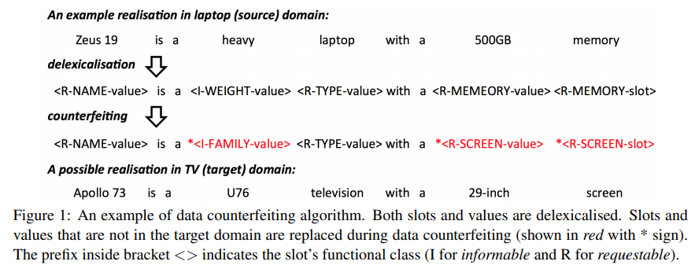
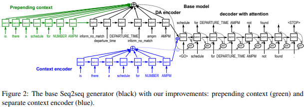
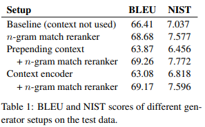

# 4-5 Reading Notes

## Multi-domain  Neural Network Language Generation for Spoken Dialogue Systems

Tsung-Hsien Wen NAACL 2016

### Motivation

面对多领域，有些新领域数据少，想通过迁移学习，从大的domain获取信息。提出一个新的方法，即从out-of-domain出发，合成一些“伪造”的数据集，然后再在in-domain上fine-tune。

### Model

基于SC-LSTM做adaption，模型结构没有变化。主要讨论的内容是如何进行数据的构造和迁移学习的训练。

现在的任务是，给定源领域和目标领域的训练样例（正常的DA+slot pairs+sentence）训练合适的SC-LSTM参数来在目标领域上获得好效果。

正常的迁移学习流程是，或者说是pre-train+fine-tune流程：

1. 在源领域（去词化后）的数据上训练一个model
2. 使用early-stop和更小的初始学习率，将这个model在目标领域数据上去训练

尽管这样的方法可以共享LM部分的参数，但是这个流程的问题在于，相似的slot-value参数难以共享，而且目标领域有很多的独有的slot，只能重新学习。

为了最大化迁移学习的好处，model应该能够1）根据源领域在训练中见到的相似的slot-value pair生成没见过的pair。2）能够区分这些相似但是不同的pair。文章提出了一种数据伪造方法来从源领域合成目标领域数据，过程如下：

1. 根据相似性，将源领域和目标领域的slot分类。在这里，分成了三类，informable，requestable，binary。（informable包含所有非二值化的informable slot，而binary则反之）
2. 对所有的slot和value进行去词化处理
3. 对于源领域样例中的所有slot，随机的用一个目标领域中与其分类相同的slot替换，形成一个新的样例，进而形成一个伪造的数据集。
4. 在伪造的数据集上训练一个model
5. 然后在真实的目标领域数据集上fine-tune

这种方式允许model在相似的pair间共享参数，并且能够见到没见过的pair

### Experiment

除了SC-LSTM中的数据集hotel和restaurant，还新给出了两个数据集--购买TV和Laptop

train-from-scratch：直接在目标领域开始训练

tune：经典的pre-train+fine-tune流程

counterfeit：本文提出的伪造法

### Conclusion

提出了一个迁移学习的数据伪造法。其实感觉算是一种数据增广。但是同时也存在很大的问题，就是这样随机替换的形成的句子，在语法上可能是正确的，但在语义上很可能不是一个正确的句子，对于LM部分的学习可能帮助不大。

## A Context-aware Natural Language Generator for Dialogue Systems

SIGDIAL 2016 short paper

### Motivation

这篇其实是对之前Seq2Seq+Attn的一个改进，认为之前的没有考虑到用户的话语。而用户话语的信息应该是也有帮助的。作者称这种是一个adaption或者说是entrainment

### Model

之前的seq2seq+attn的生成器，就是基于此结构上加入了一个Context Encoder

之前只是将三元组作为输入，现在输入中多出了两个context内容，其实它们使用的是同一段context，使用的词典是不一样的。

然后有一个专门的Context Encoder再次编码同一段Context。然后两个Encoder得到的句子进行拼接，作为attention和decoder的对象

然后增加了一个reranker，针对与context的n-gram相似度，但是这里n也只是取1或2.

### Experiment & Conclusion

从结果上看是好的。但是其实也就是加入了一个小小的修改，不过引入上文是合理的。回过头来思考，引入用户的上文是合适的，那么三元组的形式呢？文中也多次提及到，比如三元组输入的形式过于简单，比如这个reranker也过于简单等等。但是seq2seq+attn已经引入了，可以期待一下后续的发展。