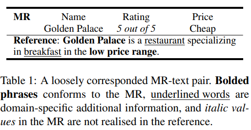
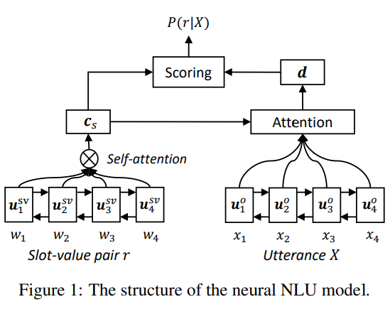
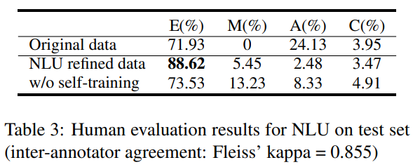
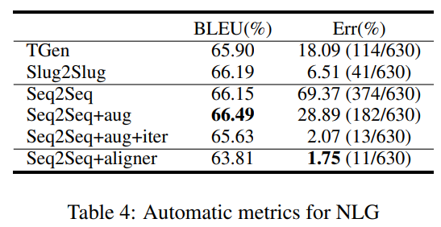
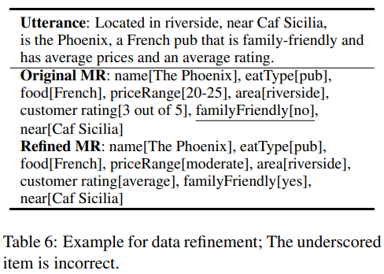
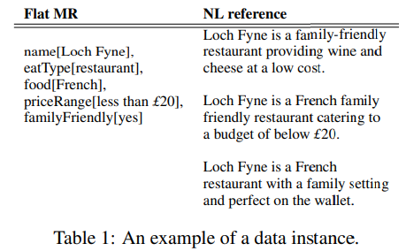
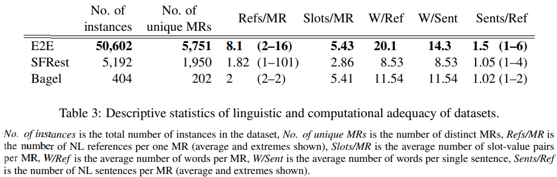

# 4-7  Reading Notes

## A Simple Recipe towards Reducing Hallucination in Neural Surface Realisation

ACL 2019 Short paper     Chin-Yew Lin

### Motivation

NLG model中的幻觉现象 hallucination比较多，但是在同样是seq2seq架构中的NMT却没有很多这种问题。作者认为其实是在data端出现了一些问题。现有的NLG数据集输入信息MRs与输出的文本信息并不等价。比如下面的例子

上面的例子中就包含了隐式的信息和没有用到的信息。对于model来说，在MRs和输出的文本中缺少这种显式的对齐信息，容易让其产生错误和幻觉现象。

所以想要通过增强MRs的方式来提高模型的表现。还使用了self-training的方式

### Model

在这篇文章中提出了一个简单的方式来提高MRs和句子之间的语义等价性。步骤如下：

1. 建立一个NLU模型去对MR进行分析学习
2. 使用这个NLU模型对现有MRs进行重建
3. 使用self-training的方式，保留confidence较高的MRs直到不再变化

对于每个slot-value pair，将其展开作为一串短的序列，使用self-attentive encoder，先过bi-lstm，再过self-attention得到这个pair的表示。同样的，利用bi-lstm得到句子的每个token的隐层表示。

然后使用pair的表示c对句子中的词做attention，加权求和后得到句子的表示d。然后对c和d进行打分。

这个打分的过程会对所有可能的slot type和slot value来一遍，以获取每种slot type下最可能的结果。

self-training的迭代更新过程：

首先使用源MRs训练一段作为warm up

然后使用它来对所有的可能打分，来控制MRs。对于每轮的结果，打分一共有两种，一种是对于pair的打分；一种是整个MRs的打分。因为包含太多的pairs不太好，分低的也不太好，于是就采用阈值来控制，丢掉分低的pairs

迭代到上限或是MRs不再变化为止。

### Experiment

### Conclusion

整体思路确实是好的，确实data端的问题是存在的，而且也提出了一个合理的解决方式。但是依旧存在一些问题，比如这里假设了噪声MRs数量是中等规模。另外一种问题就是忽略了MRs语义级别的信息，比如从priceRange[20-25]到priceRange[moderate]一个转变，这种需要一种常识或者外部知识的帮助。

## The E2E dataset: New challenges for end-to-end generation. 

SIGDIAL 2017

### Motivation

做个多一点的，难一点的，NLG数据集。

但是问题在于，为啥没有DA呢？

baseline model就是自己的TENG--seq2seq+attn

可以注意到的是，它这里每个MR的reference特别多

还进行了各种语义上的分析，意思就是更难，就不再赘述了。

主要贡献还是这一套数据集，让后人可以开刷了。